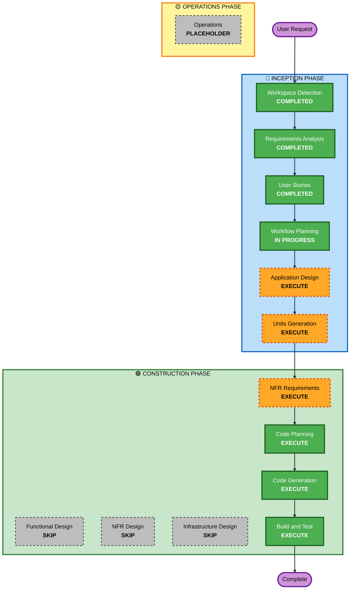

# Execution Plan

## Detailed Analysis Summary

### Project Context
- **Project Type**: Greenfield (new workshop project)
- **Primary Goal**: Create educational workshop for Agentic AI with Java 25 and Spring AI
- **Target Audience**: Students and early developers with intermediate Spring Boot knowledge
- **Workshop Duration**: 1-2 hours (quick introduction)
- **Structure**: 5 progressive chapters plus prerequisites

### Change Impact Assessment
- **User-facing changes**: Yes - Workshop participants interact with progressive learning materials and exercises
- **Structural changes**: Yes - Multi-chapter structure with progressive complexity
- **Data model changes**: No - Educational content, no persistent data models
- **API changes**: Yes - REST API endpoints for agent interactions in each chapter
- **NFR impact**: Yes - Performance (response times), usability (learning curve), maintainability (code clarity)

### Risk Assessment
- **Risk Level**: Low to Medium
- **Rationale**: 
  - Greenfield project reduces integration risks
  - Well-defined structure from reference workshop
  - Moderate complexity in translating Python patterns to Java
  - Time constraint (1-2 hours) requires careful scoping
- **Rollback Complexity**: Easy (no existing system to maintain)
- **Testing Complexity**: Simple (manual testing through exercises)

---

## Workflow Visualization

---

## Phases to Execute

### 🔵 INCEPTION PHASE
- [x] Workspace Detection (COMPLETED)
- [x] Requirements Analysis (COMPLETED)
- [x] User Stories (COMPLETED)
- [x] Workflow Planning (IN PROGRESS)
- [ ] Application Design - **EXECUTE**
  - **Rationale**: Need to define component structure for 6 chapters (prerequisites + 5 chapters), identify service layer for agent orchestration, and establish clear boundaries between chapter implementations
- [ ] Units Generation - **EXECUTE**
  - **Rationale**: Workshop has 6 distinct units (Chapter 0-5), each can be developed independently, parallel development possible, clear decomposition needed for structured implementation

### 🟢 CONSTRUCTION PHASE
- [ ] Functional Design - **SKIP**
  - **Rationale**: Educational workshop with straightforward logic, no complex business rules or data models, focus on demonstrating Spring AI patterns rather than complex algorithms
- [ ] NFR Requirements - **EXECUTE**
  - **Rationale**: Need to select tech stack (Spring Boot version, Spring AI version, Java 25 features), determine response time expectations for learning experience, establish code clarity standards for educational content
- [ ] NFR Design - **SKIP**
  - **Rationale**: No complex NFR patterns needed, standard Spring Boot setup sufficient, no performance optimization or advanced security patterns required for local workshop
- [ ] Infrastructure Design - **SKIP**
  - **Rationale**: Local development only per requirements (NFR8), no cloud deployment, no infrastructure services needed, simple Maven build sufficient
- [ ] Code Planning - **EXECUTE** (ALWAYS)
  - **Rationale**: Need detailed plan for generating 6 chapter implementations with starter code and TODOs
- [ ] Code Generation - **EXECUTE** (ALWAYS)
  - **Rationale**: Generate workshop code for all chapters
- [ ] Build and Test - **EXECUTE** (ALWAYS)
  - **Rationale**: Provide build instructions and manual testing guidance for workshop participants

### 🟡 OPERATIONS PHASE
- [ ] Operations - **PLACEHOLDER**
  - **Rationale**: Future deployment and monitoring workflows (not applicable for local workshop)

---

## Execution Strategy

### Unit Decomposition Approach
The workshop will be decomposed into 6 independent units:
1. **Unit 0**: Prerequisites and environment setup
2. **Unit 1**: Agent basics with Spring AI chat client
3. **Unit 2**: Built-in function calling
4. **Unit 3**: Custom tool development (D&D dice)
5. **Unit 4**: MCP integration
6. **Unit 5**: Multi-agent coordination (A2A)

### Development Sequence
Units can be developed in parallel after Application Design and Units Generation complete:
- **Sequential dependencies**: Each chapter builds conceptually on previous, but code can be independent
- **Parallel opportunities**: All 6 units can be coded simultaneously
- **Integration points**: Shared dependencies (Spring AI configuration, Bedrock client setup)

### Code Structure Strategy
- **Starter code with TODOs**: Per requirements (FR3, NFR14)
- **Progressive complexity**: Chapter 1 simplest, Chapter 5 most complex
- **Self-contained examples**: Each chapter runs independently
- **Minimal code**: Focus on core concepts, avoid over-engineering

---

## Estimated Timeline

### Phase Breakdown
- **Application Design**: 1 interaction (component identification)
- **Units Generation**: 1 interaction (6 units decomposition)
- **NFR Requirements**: 1 interaction (tech stack selection)
- **Code Planning**: 1 interaction per unit (6 total)
- **Code Generation**: 1 interaction per unit (6 total)
- **Build and Test**: 1 interaction (comprehensive instructions)

**Total Estimated Interactions**: ~16 interactions

---

## Success Criteria

### Primary Goal
Create a complete, working workshop that teaches Agentic AI concepts using Java 25 and Spring AI in 1-2 hours

### Key Deliverables
1. **6 Chapter Implementations**: Working code for prerequisites + 5 chapters
2. **Starter Code with TODOs**: Participants complete exercises to learn
3. **Documentation**: README files with learning objectives and instructions
4. **Build System**: Maven project that builds successfully
5. **Bedrock Integration**: All chapters use Amazon Bedrock for LLM calls
6. **D&D Theme**: Engaging examples throughout

### Quality Gates
- [ ] All chapters build successfully with Maven
- [ ] Starter code has clear TODO markers for exercises
- [ ] Each chapter demonstrates intended Spring AI concepts
- [ ] Code follows Java and Spring Boot best practices
- [ ] Documentation is clear and complete
- [ ] Workshop can be completed in 1-2 hours
- [ ] Examples are engaging with D&D theme
